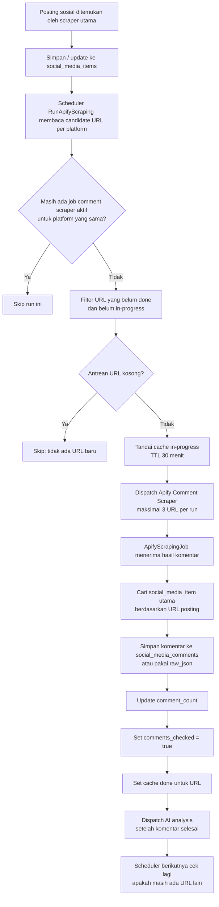
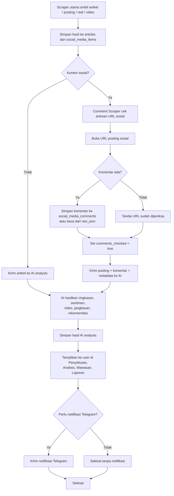

# Alur Actor Komentar Sosial

Dokumen ini menjelaskan alur kerja actor komentar untuk `Instagram`, `Facebook`, dan `TikTok` sesuai konsep utama pipeline ARUSBAWAH Media Intelligence:

1. sistem mengambil posting utama lebih dulu
2. sistem menyimpan posting
3. actor komentar memeriksa URL posting sosial
4. setelah status komentar final, data dikirim ke AI
5. hasil AI ditampilkan ke user
6. sistem mengecek apakah perlu mengirim notifikasi Telegram

Dokumen ini sengaja memakai urutan bisnis tersebut sebagai sumber kebenaran utama.

## Konsep Utama

Konsep sistem kita adalah:

- **posting utama selalu masuk dulu**
- **komentar adalah tahap pemeriksaan lanjutan**
- **AI baru jalan setelah status komentar final**
- **dashboard membaca hasil yang sudah final**
- **Telegram adalah evaluasi terakhir**

Artinya, komentar tidak berdiri sendiri. Komentar adalah pelengkap konteks dari posting utama.

## Tujuan

Actor komentar bertugas:

- mengambil URL posting sosial yang sudah ditemukan sebelumnya
- membuka URL posting tersebut melalui actor `Comment Scraper`
- mengambil komentar dari posting
- menyimpan hasil komentar ke sistem
- menandai URL tersebut agar tidak dibaca ulang terus-menerus
- mengecek apakah masih ada URL lain yang belum diproses

## Prinsip Inti

- Sumber antrean berasal dari tabel `social_media_items`
- Kunci URL adalah `post_url`
- Status selesai diperiksa disimpan di `comments_checked`
- Status antrean runtime dibantu cache:
  - `comments_scraped_for_post:{md5(url)}`
  - `comments_scraping_in_progress:{md5(url)}`
- Data sosial baru boleh dianggap final setelah tahap komentar selesai diperiksa

## Ringkasan Konsep End-to-End

Urutan resmi konsep kita adalah:

1. scraper utama mengambil artikel, posting, reel, atau video
2. hasil utama disimpan ke database
3. jika itu konten sosial, sistem mengecek URL komentarnya
4. komentar diambil jika ada
5. jika komentar kosong, item tetap ditandai sudah diperiksa
6. setelah status komentar final, sistem mengirim posting dan komentar ke AI
7. AI menghasilkan ringkasan, sentimen, risiko, dan jangkauan
8. hasil AI ditampilkan ke user
9. sistem mengecek apakah item itu perlu notifikasi Telegram

## Diagram Alur

## Diagram End-to-End

## Narasi End-to-End

Urutan alur penuh sistem adalah:

1. scraper utama mengambil artikel atau posting sosial
2. hasil mentah disimpan ke database
3. jika konten adalah sosial, actor komentar memeriksa URL posting
4. komentar diambil jika ada
5. jika komentar kosong, item tetap ditandai sudah diperiksa
6. setelah status komentar final, data dikirim ke AI
7. AI menghasilkan analisis
8. hasil analisis ditampilkan ke user
9. sistem mengecek apakah item itu perlu mengirim notifikasi Telegram

## Inti Logika Bisnis

- komentar tidak harus selalu ada
- yang penting URL sudah diperiksa
- setelah diperiksa, item bisa lanjut ke AI
- setelah AI selesai, item bisa tampil ke dashboard
- Telegram adalah langkah evaluasi terakhir, bukan langkah pertama
- actor komentar tidak menjadi sumber utama data, melainkan pelengkap dari posting utama

## Langkah Kerja Detail

### 1. Posting sosial masuk dulu

Pipeline sosial utama lebih dulu menemukan posting dari:

- Instagram
- TikTok
- Facebook

Lalu posting itu disimpan ke tabel `social_media_items` dengan field penting seperti:

- `platform`
- `post_url`
- `comment_count`
- `raw_json`
- `comments_checked`

Pada tahap ini sistem baru menyimpan **postingan utamanya**, belum final dari sisi komentar.

### 2. Scheduler membaca kandidat URL komentar

Command [RunApifyScraping.php](/Users/unity/Documents/proyek%20baru/app/Console/Commands/RunApifyScraping.php) membaca `social_media_items` per proyek dan per platform.

Untuk actor bertipe `Comment Scraper`, sistem tidak lagi mencari kata kunci, tetapi langsung mengantrikan `post_url`.

Ini sesuai konsep kita:

- posting utama sudah ada
- actor komentar tinggal membaca URL posting yang sudah tersimpan

### 3. Sistem mencegah URL yang sama dibuka berulang

Sebelum URL dikirim ke actor komentar, sistem memeriksa 2 cache:

- `doneKey`
  - URL sudah selesai dibaca
- `inProgressKey`
  - URL sedang dibaca sekarang

Hanya URL yang lolos dua filter ini yang boleh masuk antrean.

### 4. Maksimal 3 URL per run

Setiap run comment scraper hanya mengirim maksimal 3 URL baru untuk satu platform.

Tujuannya:

- menjaga queue tetap ringan
- menghindari pembacaan duplikat besar-besaran
- memberi ruang retry jika ada error

### 5. URL ditandai sedang diproses

Sebelum dispatch ke Apify, setiap URL yang dipilih diberi cache:

- `comments_scraping_in_progress:{md5(url)}`

TTL default saat ini adalah 30 menit.

Artinya selama job belum selesai atau belum timeout, scheduler tidak akan mengirim URL itu lagi.

### 6. Hasil komentar diproses oleh job

Setelah actor komentar selesai, [ApifyScrapingJob.php](/Users/unity/Documents/proyek%20baru/app/Jobs/ApifyScrapingJob.php) memproses hasilnya.

Sistem akan:

- mencocokkan hasil ke `social_media_item` utama
- menyimpan komentar ke tabel `social_media_comments` bila tersedia
- atau memakai struktur `raw_json` bila komentar tetap berada di payload
- memperbarui `comment_count`

Jadi pada tahap ini posting utama diperkaya dengan konteks komentar.

### 7. URL dianggap selesai dibaca

Setelah proses berhasil, item utama ditandai:

- `comments_checked = true`

Maknanya:

- URL posting itu sudah diperiksa
- sistem tidak perlu membuka ulang URL yang sama pada run normal berikutnya
- posting itu boleh dipakai AI analysis dan dashboard

Ini adalah titik perubahan status dari:

- **belum final**

menjadi:

- **final untuk diproses AI**

### 8. Jika antrean habis, actor berhenti

Pada run berikutnya, scheduler akan cek lagi:

- apakah masih ada URL yang belum `done`
- apakah masih ada URL yang belum `in-progress`

Kalau tidak ada, actor komentar skip otomatis.

## Arti Status `comments_checked`

`comments_checked = true` berarti:

- URL posting sudah selesai diperiksa oleh jalur comment scraper

Itu tidak selalu berarti:

- semua komentar dipindah ke tabel `social_media_comments`

Karena pada beberapa kasus komentar tetap valid dibaca dari `raw_json`.

## Status URL dalam Sistem

### 1. Belum diproses

Ciri:

- belum ada `doneKey`
- belum ada `inProgressKey`
- `comments_checked` biasanya masih `false`

Efek:

- URL boleh masuk antrean comment scraper

### 2. Sedang diproses

Ciri:

- ada `inProgressKey`

Efek:

- URL tidak boleh dikirim ulang selama TTL aktif

### 3. Selesai diproses

Ciri:

- ada `doneKey`
- `comments_checked = true`

Efek:

- URL tidak diantrikan lagi pada run normal

## Hubungan Dengan AI

Setelah `comments_checked = true`, sistem dapat melanjutkan data sosial ke AI.

AI menerima konteks berupa:

- posting utama
- metadata platform
- komentar jika ada
- indikator engagement

Lalu AI menghasilkan:

- ringkasan
- sentimen
- risiko
- jangkauan
- rekomendasi

Kalau komentar kosong tetapi URL sudah diperiksa, AI tetap bisa jalan dengan konteks posting utama saja.

## Hubungan Dengan Dashboard

Di [MediaDashboard.php](/Users/unity/Documents/proyek%20baru/app/Livewire/MediaDashboard.php), posting sosial yang masih punya `comments_checked = false` disembunyikan dulu dari tampilan tertentu.

Tujuannya:

- dashboard tidak menampilkan data sosial yang proses komentarnya belum final
- user melihat data yang sudah dianggap selesai diperiksa sistem

## Hubungan Dengan Telegram

Telegram bukan tahap awal pipeline.

Telegram baru diperiksa setelah:

- data selesai diproses AI
- hasilnya sudah punya dasar evaluasi risiko / notifikasi

Jadi urutannya adalah:

- scraper
- komentar
- AI
- dashboard
- Telegram

## Ringkasan Sederhana

Urutan kerjanya adalah:

1. posting sosial ditemukan
2. posting disimpan
3. URL posting dicek oleh actor komentar
4. komentar diambil jika ada
5. kalau kosong, tetap ditandai sudah diperiksa
6. setelah itu data dikirim ke AI
7. hasil AI tampil ke user
8. terakhir sistem mengecek apakah perlu Telegram

## Referensi Kode

- [RunApifyScraping.php](/Users/unity/Documents/proyek%20baru/app/Console/Commands/RunApifyScraping.php)
- [ApifyScrapingJob.php](/Users/unity/Documents/proyek%20baru/app/Jobs/ApifyScrapingJob.php)
- [MediaDashboard.php](/Users/unity/Documents/proyek%20baru/app/Livewire/MediaDashboard.php)
- [2026_07_30_200000_add_comments_checked_to_social_media_items.php](/Users/unity/Documents/proyek%20baru/database/migrations/2026_07_30_200000_add_comments_checked_to_social_media_items.php)
